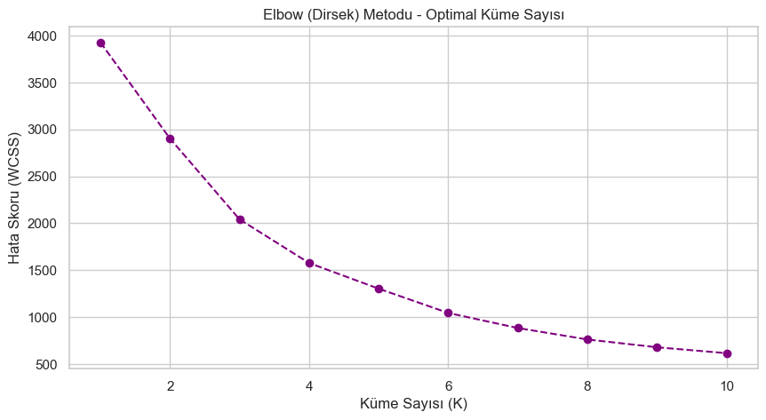
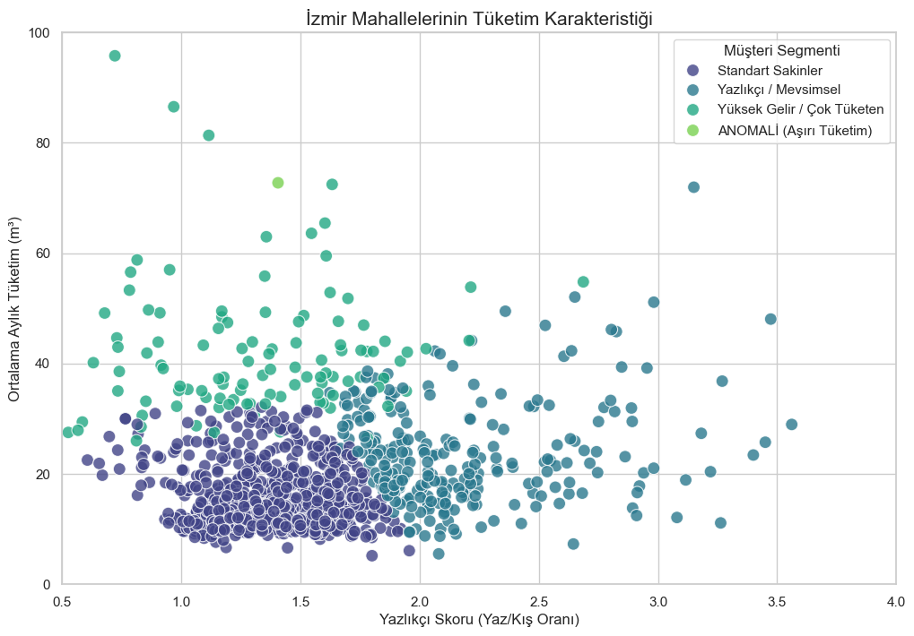
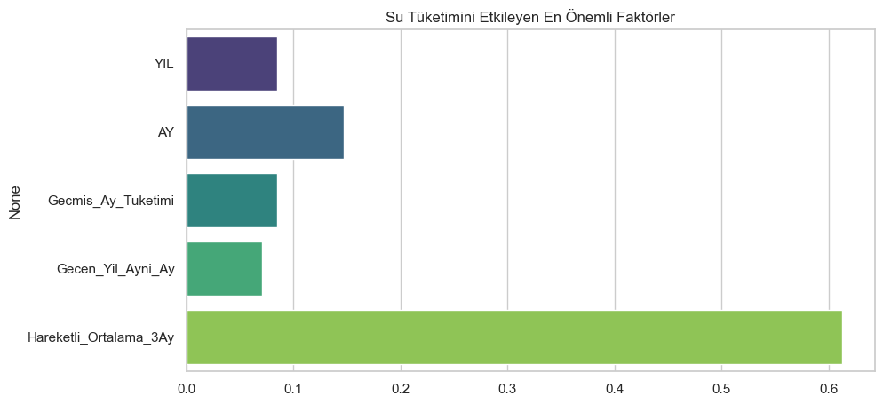

#  İzmir İli Su Tüketim Davranışlarının Makine Öğrenmesi ile Analizi

**Öğrenci:** Eren Altuncu  
**Danışman:** Prof. Dr. Muhammed Maruf Öztürk

##  Proje Özeti
Bu proje, İzmir genelindeki mahallelerin su tüketim verilerini analiz ederek tüketim alışkanlıklarını modeller. K-Means kümeleme algoritması kullanılarak "Yazlıkçı", "Standart" ve "Aşırı Tüketim (Anomali)" bölgeleri tespit edilmiştir. Amaç, şebeke kayıp/kaçaklarını ve altyapı risklerini veri odaklı olarak yönetmektir.

##  Kullanılan Teknolojiler
* **Python 3.x**
* **Pandas:** Büyük veri işleme ve temizleme (BOM encoding fix, optimizasyon).
* **Scikit-Learn:** K-Means Clustering ve StandardScaler.
* **Seaborn/Matplotlib:** Veri görselleştirme.

##  Metodoloji

### 1. Optimal Küme Sayısı (Elbow Metodu)
Veri setindeki tüketim davranışlarını en iyi ayrıştıran küme sayısının 4 olduğu matematiksel olarak doğrulanmıştır.



### 2. Segmentasyon Sonuçları
Mahalleler tüketim karakteristiğine göre 4 ana gruba ayrılmıştır. Kırmızı/Yeşil noktalar (Anomaliler) ve Mavi noktalar (Yazlıkçılar) görülmektedir.



##  Kritik Bulgular (Anomali Tespiti)
Model, aşağıdaki bölgelerde **acil müdahale gerektiren** aşırı tüketim (kaçak şüphesi) tespit etmiştir:

| İlçe | Mahalle | Ortalama Tüketim (m³) | Durum | Eylem Planı |
|---|---|---|---|---|
| GAZİEMİR | GAZİKENT | **185.57** |  ANOMALİ | Kaçak ekibi yönlendirilmeli |
| KARŞIYAKA | M. KEMAL | **118.48** |  ANOMALİ | Altyapı kontrol edilmeli |
| ALİAĞA | BOZKÖY | 19.87 |  YAZLIKÇI | Yazın basınç artırılmalı |

##  Gelecek Tüketim Tahmini ve Model Karşılaştırması (Forecasting)

Projenin ileri aşamasında, 6 farklı makine öğrenmesi algoritması (AdaBoost, RF, Gradient Boosting, KNN, Decision Tree, SVR) yarıştırılmıştır.

###  Deneysel Sonuçlar
Yapılan testler sonucunda, **AdaBoost Regressor** en başarılı model olmuştur.

| Model | R² Skoru | MAPE (Hata Oranı) | Durum |
| :--- | :--- | :--- | :--- |
| **AdaBoost (Bizim Model)** | **0.894** | **%2.76** |  En İyi Performans |
| Random Forest | 0.888 | %2.55 | Çok Başarılı |
| Gradient Boosting | 0.872 | %2.78 | Başarılı |
| KNN Regressor | 0.742 | %3.97 | Orta |
| SVR (Destek Vektör) | -0.626 | %8.74 | Başarısız |

*Bu çalışmada dış veri (sıcaklık vb.) kullanılmadan **Feature Engineering (Öznitelik Mühendisliği)** teknikleriyle **R²=0.894** skoruna ulaşılmış ve hata oranı **%2.76** seviyesine indirilmiştir.


### 📈 Etkili Faktörler
Modelin tahmin başarısında en etkili değişkenin "Hareketli Ortalamalar (MA_3)" ve "Mevsimsellik (Yaz Sezonu)" olduğu görülmüştür. Bu durum, geçmiş tüketim trendlerinin gelecek için en güçlü belirti olduğunu kanıtlar.



##  Kurulum ve Çalıştırma

1. Repoyu klonlayın:
   ```bash
   git clone https://github.com/erenaltuncu/Izmir-Water-Consumption-Clustering.git

2. Gerekli paketleri yükleyin: 
pip install -r requirements.txt

3. Notebook'u çalıştırın:
jupyter notebook main.ipynb
